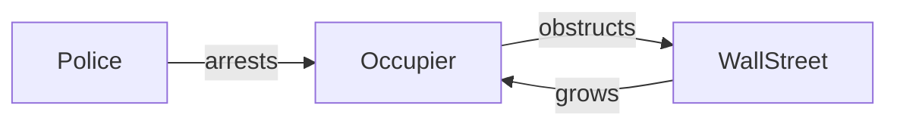
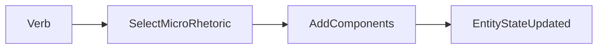
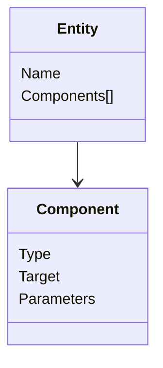
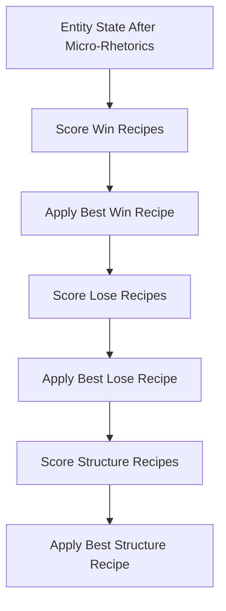
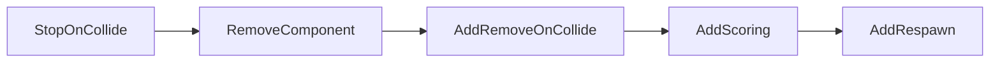
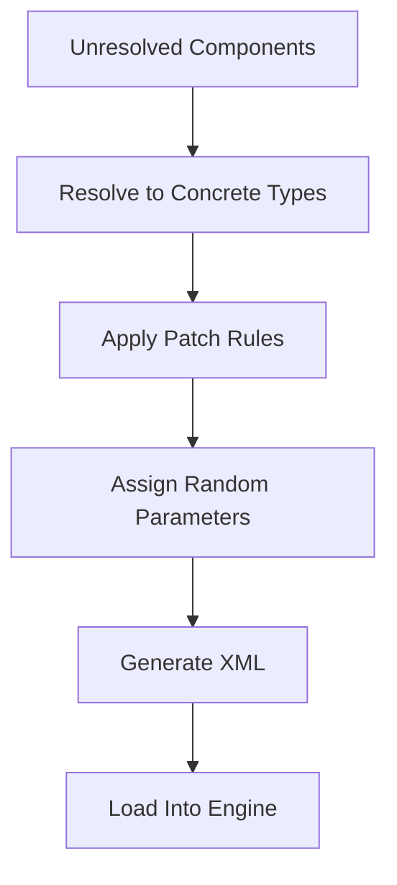
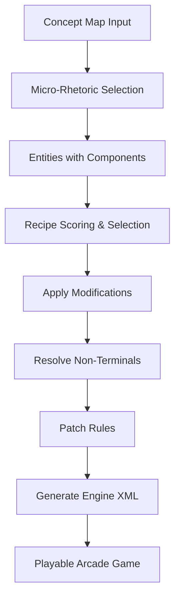
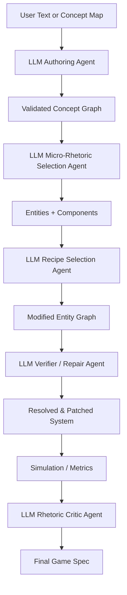

# Game‑O‑Matic — Original System Architecture Overview

This document explains how the original **Game‑O‑Matic** system transforms a concept map into a playable arcade-style videogame.

---

# 1. High-Level Pipeline

```mermaid
flowchart TD
    A[User Concept Map\n(Nouns + Verb Relationships)] --> B[Micro‑Rhetoric Selection]
    B --> C[Attach Components to Entities]
    C --> D[Recipe Selection\n(Win / Lose / Structure)]
    D --> E[Apply Recipe Modifications]
    E --> F[Resolve Non‑Terminal Components]
    F --> G[Patch Rules Applied]
    G --> H[Generate XML for Game Engine]
    H --> I[Playable Game]
```

---

# 2. Concept Map Input

Users provide a **concept map**:

* Nodes → **Nouns (Entities)**
* Directed Edges → **Verbs (Relationships)**
* No explicit chronology
* All relationships are binary (two nouns)

### Example



The system interprets:

* Nouns → Game Entities
* Verbs → Mechanics to apply

---

# 3. Micro‑Rhetorics

Each **verb** maps to one of several possible **micro‑rhetorics**.

A micro‑rhetoric is:

* An abstract gameplay pattern
* Tagged with semantic meaning
* Implemented as component modifications

### Example Mapping

| Verb      | Example Micro‑Rhetoric | Gameplay Effect              |
| --------- | ---------------------- | ---------------------------- |
| arrests   | take custody           | Stop on collide              |
| obstructs | freeze                 | Prevent movement             |
| grows     | grow on collide        | Increase size on interaction |

### Micro‑Rhetoric Application



Entities are assigned:

* Movement components
* Collision behaviors
* Growth/shrink rules
* Non‑terminal placeholders (resolved later)

---

# 4. Component-Based Entity Model

Each entity accumulates components.



Examples:

* `_movesInAnyWay`
* `StopOnCollideComponent`
* `GrowOnCollideComponent`
* `_isRemovedBy`
* `ScoreRemovalOfComponent`

---

# 5. Recipe System

After micro‑rhetorics are applied, the system selects **recipes**.

There are three major types:

* Win Recipes
* Lose Recipes
* Structure Recipes

Recipes are scored based on:

* Preconditions
* Component tags
* Compatibility

### Recipe Flow



---

# 6. Recipe Modifications

Recipes modify entities by:

1. Adding components
2. Removing components
3. Replacing components
4. Writing to blackboard (global state)
5. Setting the player entity

Example transformation:



This ensures:

* The game is winnable
* The player has agency
* Score progression exists

---

# 7. Finalization Phase

After recipes:

1. Resolve non‑terminal components into concrete engine components
2. Apply patch rules (e.g., ensure movement exists)
3. Randomly assign unset parameters (speed, size, spawn rate)
4. Generate engine XML
5. Generate instruction text



---

# 8. Emergent Meaning

Important properties of the system:

* No explicit narrative timeline
* Meaning emerges from mechanics
* Rhetoric is encoded through gameplay rules
* Multiple games can be generated from the same concept map

---

# 9. Complete System Diagram



---

# Summary

Game‑O‑Matic is a:

* Concept‑map‑driven
* Component‑based
* Rule‑selected
* Rhetorically motivated
* Arcade‑style game generator

It converts abstract idea graphs into procedural systems whose mechanics are meant to express those ideas.

---

# 10. Example Micro‑Rhetorics Library (Extended List)

Below is a rationalized list of micro‑rhetorics that make systemic and rhetorical sense in an arcade-style component system.

## Interaction Micro‑Rhetorics

* **Take Custody** → StopOnCollide(target)
* **Remove On Contact** → RemoveOnCollide(target)
* **Damage Overlap** → ReduceHealthOnCollide(target)
* **Freeze Target** → StopMovementOnCollide(target)
* **Reflect Target** → ReflectOnCollide(target)
* **Push Back** → ApplyForceOnCollide(target)
* **Absorb** → RemoveTargetAndGrow(self)
* **Convert** → TransformTargetIntoSelf(target)
* **Swap Roles** → ExchangeMovementOrState(target)

## Growth / Decay Micro‑Rhetorics

* **Grow On Contact** → GrowOnCollide(target)
* **Shrink On Contact** → ShrinkOnCollide(target)
* **Spawn On Event** → SpawnEntityOnRemove(target)
* **Multiply Over Time** → SpawnPeriodically
* **Decay Over Time** → ShrinkOverTime
* **Escalate Speed** → IncreaseSpeedOverTime

## Control / Constraint Micro‑Rhetorics

* **Follow Target** → SeekMovement(target)
* **Avoid Target** → FleeMovement(target)
* **Block Path** → StaticObstacleComponent
* **Chase Player** → HomingMovement(player)
* **Wander** → RandomMovement
* **Guard Zone** → PatrolBetweenPoints

## Resource Micro‑Rhetorics

* **Collect For Score** → AddScoreOnCollide
* **Consume Resource** → RemoveResourceOnUse
* **Require Resource** → ConditionalActionIfHasResource
* **Waste Resource** → DecreaseMeterOverTime
* **Charge Meter** → IncreaseMeterOnEvent

## State Change Micro‑Rhetorics

* **Empower** → IncreaseSizeOrSpeed
* **Weaken** → ReduceCapabilities
* **Immobilize Temporarily** → TimedDisableComponent
* **Reveal / Watch** → TriggerEventOnProximity
* **Influence** → ModifyTargetParameters

---

# 11. Example Recipe Library

Recipes operate at a higher structural level and ensure playability.

## Win Recipes

* **Score Threshold Win** → Reach X points
* **Eliminate All Of Type** → Remove all Y
* **Survive Duration** → Last T seconds
* **Reach Goal Zone** → Player reaches specific area
* **Grow Beyond Size** → Player exceeds threshold size
* **Collect All Items** → All collectibles removed
* **Escort Entity Safely** → Target survives until timer ends

## Lose Recipes

* **Run Out Of Time** → Timer reaches zero
* **Health Depletion** → Player health reaches zero
* **Protected Entity Removed** → Critical entity destroyed
* **Enemy Reaches Goal** → Target reaches boundary
* **Meter Overflow** → Negative meter state

## Structure Recipes

* **Frogger Layout** → Player left, hazards middle lanes
* **Asteroids Layout** → Player center, enemies spawn edges
* **Space Invaders Layout** → Player bottom, enemies top
* **Arena Layout** → Enemies spawn around player
* **Chase Layout** → One pursuer, one runner
* **Tower Defense Layout** → Path with wave spawns

## Patch Recipes

* **Ensure Movement Exists** → Add default movement
* **Ensure Collisions Enabled** → Add colliders
* **Ensure Player Assigned** → Pick controllable entity
* **Ensure Spawn Loop** → Add respawn if win requires repetition
* **Clamp Parameters** → Enforce valid speed/size ranges

---

# 12. Component‑Based Entity Model (Expanded List)

Below is a comprehensive list of components that fit the Game‑O‑Matic paradigm.

## Core Components

* TransformComponent (position, rotation, scale)
* ColliderComponent
* MovementComponent
* RenderComponent
* InputComponent

## Movement Components

* RandomMovementComponent
* SeekTargetComponent
* FleeTargetComponent
* PatrolComponent
* HorizontalOnlyMovement
* VerticalOnlyMovement

## Collision Components

* StopOnCollideComponent
* RemoveOnCollideComponent
* ReflectOnCollideComponent
* DamageOnCollideComponent
* GrowOnCollideComponent
* ShrinkOnCollideComponent

## Lifecycle Components

* HealthComponent
* RespawnOnRemoveComponent
* SpawnOnTimerComponent
* RemoveAfterTimeComponent
* TransformOnEventComponent

## Scoring & UI Components

* ScoreRemovalOfComponent
* MeterComponent
* TimerComponent
* WinConditionComponent
* LoseConditionComponent

## Tag / Semantic Components

* _isVulnerable
* _isCollidable
* _isRemovable
* _isPlayerControlled
* _isHazard
* _isCollectible

---

# 13. Additional System Concepts (Often Overlooked)

These elements are implicit in the paper but important architecturally.

## Blackboard / Global State

* Shared symbolic memory
* Stores win targets (e.g., removeToWin Y)
* Used for recipe preconditions

## Parameter Ranges

* Speed ranges
* Spawn frequency ranges
* Size ranges
* Score increments
* Timer duration

## Non‑Terminal Components

* Abstract placeholders (e.g., _movesInAnyWay)
* Resolved later into concrete implementations
* Allow flexible binding before finalization

## Scoring / Selection Logic

* Recipe scoring based on tag compatibility
* Random tie-breaking among highest score
* Preconditions enforce systemic coherence

## Instruction Generation

* Identify player entity
* Identify win condition
* Generate control instructions
* Generate objective description

## Variation Mechanisms

* Random parameter sampling
* Random micro‑rhetoric selection
* Random recipe selection among top candidates

## Constraints for Accessibility

* Binary verb relationships only
* No explicit chronology
* Limited verb vocabulary
* Simple arcade-style mechanics

---

These lists collectively describe the complete rational structure required to reconstruct the original Game‑O‑Matic system faithfully while making its architecture explicit and modular.

---

# 14. LLM Agent Integration Points (Rational Recreation Layer)

This section explains **where LLM agents enter the pipeline**, what decisions they make, and the exact input/output contracts required to keep the system rational and auditable.

The key principle:

> LLMs propose and justify decisions. The symbolic system executes them.

---

# 15. Updated Pipeline With LLM Agents



---

# 16. Agent 1 — Authoring Agent

## Purpose

Convert natural language descriptions into structured concept maps.

## Input

* Free-form user text OR
* Raw concept map

## Output (Strict Schema)

```json
{
  "entities": ["Police", "Occupier", "WallStreet"],
  "relations": [
    {"subject": "Police", "verb": "arrests", "object": "Occupier"},
    {"subject": "Occupier", "verb": "obstructs", "object": "WallStreet"}
  ],
  "confidence": 0.92
}
```

## Constraints

* Must use supported verb vocabulary
* Binary relations only
* No hidden chronology

The symbolic layer validates this graph before proceeding.

---

# 17. Agent 2 — Micro‑Rhetoric Selection Agent

## Purpose

Select appropriate micro‑rhetorics for each verb relation.

## Input

* Validated concept graph
* Micro‑rhetoric library (retrieved via RAG)
* Entity component state

## Output

```json
{
  "selections": [
    {
      "relation": "Police arrests Occupier",
      "micro_rhetoric": "Take Custody",
      "justification": "Arrest implies immobilization after contact.",
      "preconditions_satisfied": true
    }
  ]
}
```

## Important

* LLM proposes
* Engine verifies preconditions
* Only approved components can be added

---

# 18. Agent 3 — Recipe Selection Agent

## Purpose

Select win / lose / structure recipes based on current entity state.

## Input

* Entity + component graph
* Recipe library
* Blackboard state

## Output

```json
{
  "win_recipe": "Score Threshold Win",
  "lose_recipe": "Run Out Of Time",
  "structure_recipe": "Frogger Layout",
  "justifications": {
    "win": "Removal mechanics exist, enabling score-based win.",
    "structure": "Multiple hazards support lane-based design."
  }
}
```

## Guardrails

* Engine computes compatibility score
* LLM may only select from top-k valid recipes

---

# 19. Agent 4 — Verifier / Repair Agent

## Purpose

Ensure playability and player agency.

## Input

* Fully assembled but unresolved game spec
* Static analysis results
* Simulation metrics

## Output

```json
{
  "issues": ["Player lacks direct removal capability"],
  "repairs": [
    {
      "operator": "ReplaceComponent",
      "target": "WallStreet",
      "from": "StopOnCollide",
      "to": "RemoveOnCollide"
    }
  ]
}
```

## Repair Operators (Restricted Set)

* AddComponent
* RemoveComponent
* ReplaceComponent
* AdjustParameter
* AssignPlayer

No arbitrary code generation allowed.

---

# 20. Agent 5 — Rhetoric Critic Agent

## Purpose

Evaluate whether gameplay mechanics still express the intended idea.

## Input

* Original concept graph
* Final mechanic graph
* Simulation summary

## Output

```json
{
  "alignment_score": 0.81,
  "interpretation": "The system suggests Wall Street is repeatedly weakened by Occupiers.",
  "mismatches": ["Police feel ineffective"],
  "suggested_swaps": [
    {
      "entity": "Police",
      "replace": "RandomMovement",
      "with": "SeekTarget"
    }
  ]
}
```

The symbolic engine validates and applies only permitted swaps.

---

# 21. Agent 6 — Balancing Agent

## Purpose

Tune parameters for difficulty and pacing.

## Input

* Simulation metrics (win rate, average duration, score rate)
* Parameter ranges

## Output

```json
{
  "adjustments": [
    {"entity": "WallStreet", "parameter": "speed", "delta": -10%},
    {"entity": "Police", "parameter": "spawn_rate", "delta": +15%}
  ]
}
```

Applied within bounded parameter ranges.

---

# 22. Shared Blackboard (Agent Coordination)

All agents read/write structured state:

```json
{
  "concept_graph": {},
  "entity_state": {},
  "selected_recipes": {},
  "win_conditions": {},
  "metrics": {}
}
```

This ensures:

* Traceability
* Deterministic replay
* Auditable decision chain

---

# 23. Rational Guarantees in the LLM Version

To preserve the spirit of the original system:

* LLMs never directly generate engine code
* All actions map to predefined operators
* All selections validated against preconditions
* All parameters bounded
* All decisions logged with justification

---

# 24. What This Adds Beyond the Original Paper

Compared to the original Game‑O‑Matic:

* Natural language input support
* Multi‑pass rhetorical critique
* Automated solvability testing
* Parameter balancing via feedback loop
* Explainable decision traces

---

# Final Architectural Summary

The rational LLM-based recreation keeps:

* The symbolic micro‑rhetoric core
* The recipe scoring framework
* The component-based entity system

But augments them with:

* LLM agents for semantic mapping
* Controlled repair operations
* Iterative evaluation and refinement
* Full input/output schema enforcement

This results in a system that is:

* Interpretable
* Auditable
* Modular
* Extensible
* And still faithful to procedural rhetoric as mechanics-driven meaning.
